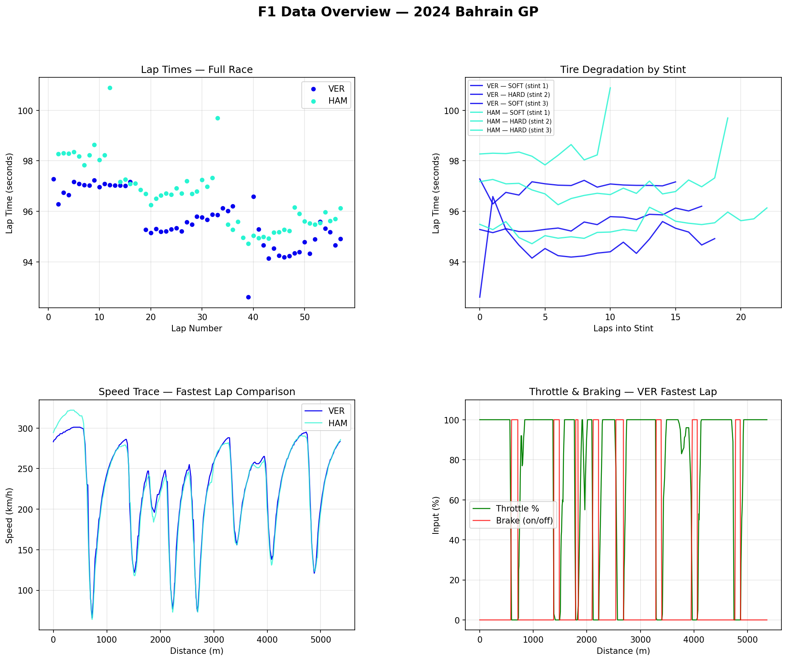
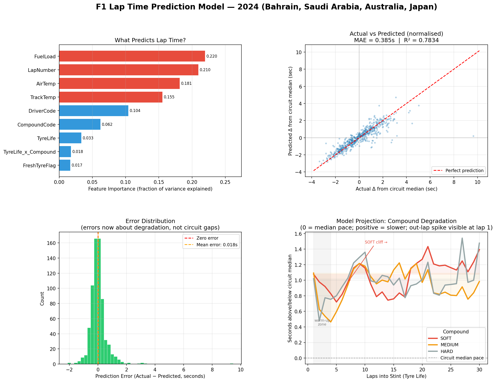
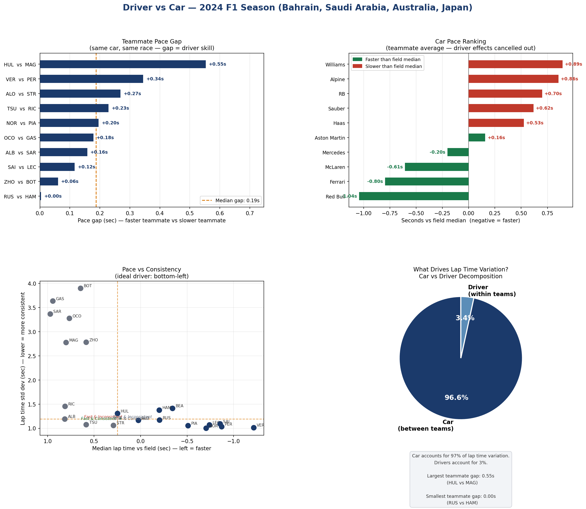
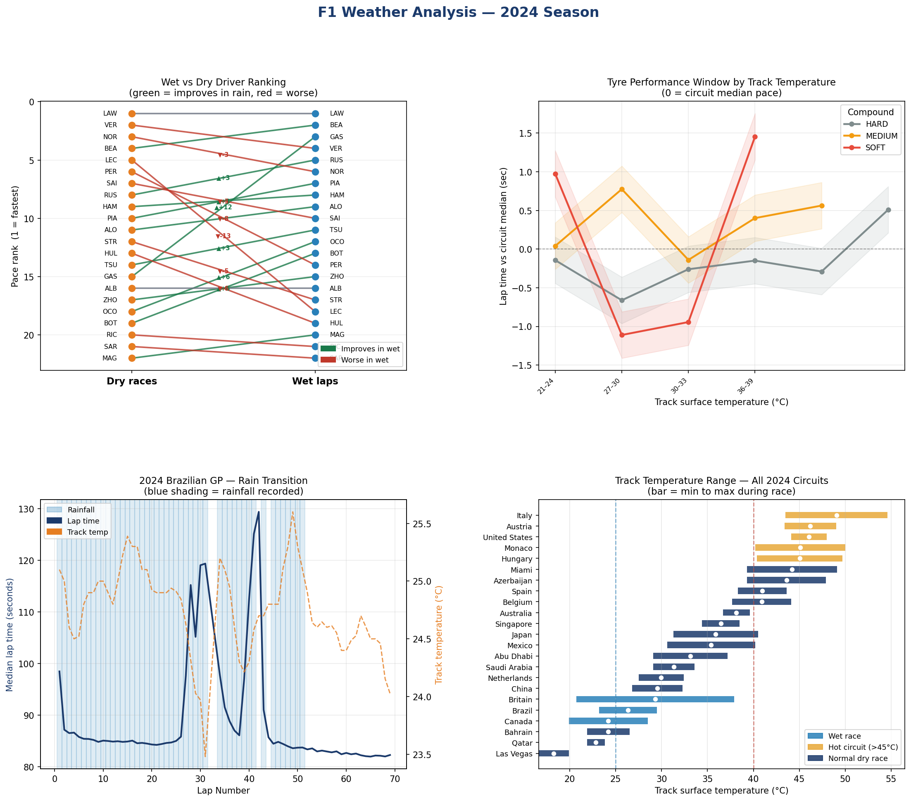
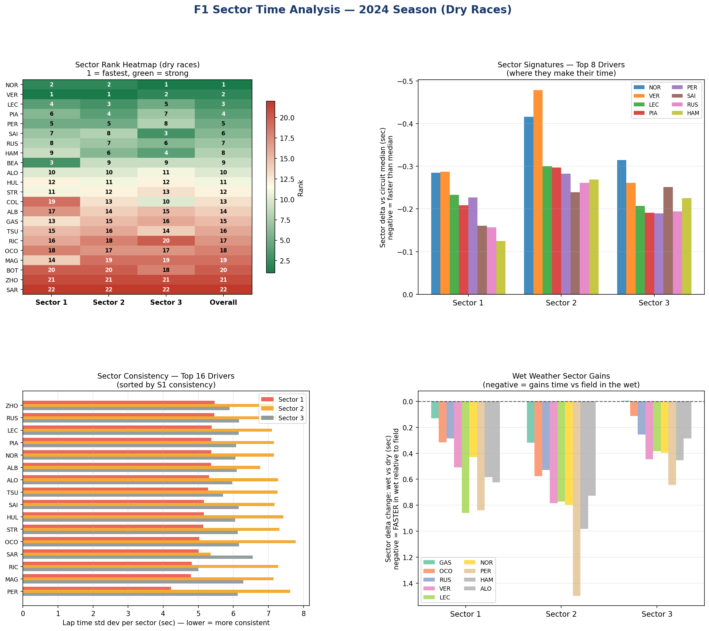

# F1 Telemetry Analysis — 2024 Season

> **Using real Formula 1 timing and telemetry data to answer engineering questions about what actually drives lap time.**

---

## 📄 [Read the Full Report (PDF)](outputs/F1_Full_Report.pdf)

*All five analyses with charts, findings tables, and interpretation — readable directly in your browser.*

---

## Key Findings at a Glance

| Finding | Result |
|---|---|
| **What drives lap time within a race?** | Fuel burn (22%) and lap number (21%) — not tyres |
| **Car vs driver split** | 97% car, 3% driver — across 10 teams, 4 races |
| **Biggest teammate gap** | Hulkenberg beats Magnussen by **0.55s** in identical machinery |
| **Closest teammates** | Russell vs Hamilton — **0.004s** across four races |
| **Best wet weather driver** | Gasly — gains **12 positions** in wet vs dry ranking |
| **Worst wet weather driver** | Leclerc — loses **13 positions** in wet conditions |
| **Fastest car** | Red Bull — **1.04s faster** than field median (driver effects removed) |
| **Model accuracy** | Predicts lap time within **±0.38 seconds** (R² = 0.78) |

---

## Analysis 1 — Telemetry Overview

*Lap times, tyre degradation, speed traces and driver inputs — Bahrain GP, VER vs HAM*



---

## Analysis 2 — Lap Time Prediction Model

*Gradient Boosting model trained on 3,482 laps across 5 races. Fuel load (22%) and lap number (21%) dominate — tyre life contributes only 3.3%.*



**Why fuel matters more than tyres:** A car at race start carries ~110 kg of fuel burning at ~1.6 kg/lap. That weight reduction alone accounts for 5–7 seconds of lap time improvement across a race — more than any tyre effect. Strategy engineers are simultaneously managing a car getting lighter (faster) and tyres wearing out (slower).

---

## Analysis 3 — Driver vs Car

*Same car, same race: any gap between teammates is the driver, not the machinery.*



**97% of lap time variation is the car. 3% is the driver.** This doesn't mean drivers are unimportant — a 0.5s teammate gap over a season is worth millions in prize money and multiple championship positions. It means the most impactful decision a driver makes is which contract they sign.

---

## Analysis 4 — Weather & Temperature

*Three wet races (Canada, Britain, Brazil), full track temperature range from 17°C (Las Vegas, night race) to 55°C (Italy).*



**Tyre grip window:** 38–45°C track surface temperature is where all three slick compounds perform best. Below 30°C, tyres can't generate heat. Above 50°C, softs degrade rapidly. Las Vegas is a special case — a night race in November Nevada desert, track surface barely above 17°C.

---

## Analysis 5 — Sector Time Analysis

*Where each driver actually makes their time. 15,898 laps across 16 circuits.*



**Verstappen vs Norris:** VER is fastest in Sector 1 (high-speed corners); NOR leads in Sector 3 (braking and traction). This reflects real car characteristics — Red Bull's aerodynamic dominance in fast corners vs McLaren's mechanical grip advantage in slow/technical sections.

**Gasly's +12 wet ranking gain** comes almost entirely from Sector 2 — medium-speed technical corners where smooth throttle and brake control under low grip separates drivers. Leclerc's -13 drop is concentrated in exactly the same sector type.

---

## Setup

```bash
git clone https://github.com/bobsterbeat/f1-analysis.git
cd f1-analysis
python3 -m venv venv && source venv/bin/activate
pip install -r requirements.txt
```

## Run

```bash
cd scripts
python3 f1_overview.py        # telemetry explorer  (edit YEAR, RACE, DRIVER_A/B)
python3 f1_prediction.py      # lap time model      (edit RACES list)
python3 f1_driver_vs_car.py   # driver vs car
python3 f1_weather.py         # weather analysis
python3 f1_sectors.py         # sector breakdown
```

Data downloads automatically via FastF1 and caches locally. First run takes a few minutes per race; subsequent runs are instant.

---

## Tools

| Tool | Role |
|---|---|
| [FastF1](https://docs.fastf1.dev/) | Official F1 timing & telemetry data |
| pandas / numpy | Data processing |
| matplotlib | Charts |
| scikit-learn | Gradient Boosting model |
